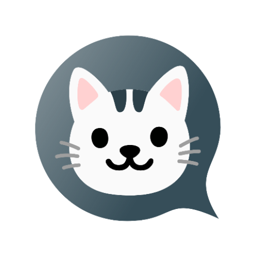

## Delta Chaton

[](https://apps.obtainium.page/redirect?r=obtainium://app/%7B%22id%22%3A%22s1m.deltachaton%22%2C%22url%22%3A%22https%3A%2F%2Fcodeberg.org%2Fs1m%2Fdelta-chaton%22%2C%22author%22%3A%22s1m%22%2C%22name%22%3A%22Delta%20Chaton%22%2C%22preferredApkIndex%22%3A0%2C%22additionalSettings%22%3A%22%7B%5C%22includePrereleases%5C%22%3Afalse%2C%5C%22fallbackToOlderReleases%5C%22%3Atrue%2C%5C%22filterReleaseTitlesByRegEx%5C%22%3A%5C%22%5C%22%2C%5C%22filterReleaseNotesByRegEx%5C%22%3A%5C%22%5C%22%2C%5C%22verifyLatestTag%5C%22%3Afalse%2C%5C%22sortMethodChoice%5C%22%3A%5C%22date%5C%22%2C%5C%22useLatestAssetDateAsReleaseDate%5C%22%3Afalse%2C%5C%22releaseTitleAsVersion%5C%22%3Afalse%2C%5C%22trackOnly%5C%22%3Afalse%2C%5C%22versionExtractionRegEx%5C%22%3A%5C%22%5C%22%2C%5C%22matchGroupToUse%5C%22%3A%5C%22%5C%22%2C%5C%22versionDetection%5C%22%3Afalse%2C%5C%22useVersionCodeAsOSVersion%5C%22%3Afalse%2C%5C%22apkFilterRegEx%5C%22%3A%5C%22%5C%22%2C%5C%22invertAPKFilter%5C%22%3Afalse%2C%5C%22autoApkFilterByArch%5C%22%3Atrue%2C%5C%22appName%5C%22%3A%5C%22%5C%22%2C%5C%22appAuthor%5C%22%3A%5C%22%5C%22%2C%5C%22shizukuPretendToBeGooglePlay%5C%22%3Afalse%2C%5C%22allowInsecure%5C%22%3Afalse%2C%5C%22exemptFromBackgroundUpdates%5C%22%3Afalse%2C%5C%22skipUpdateNotifications%5C%22%3Afalse%2C%5C%22about%5C%22%3A%5C%22%5C%22%2C%5C%22refreshBeforeDownload%5C%22%3Afalse%7D%22%2C%22overrideSource%22%3Anull%7D)

Delta Chaton is a temporary fork of [Delta Chat Android Client](https://github.com/deltachat/deltachat-android) with [UnifiedPush](https://unifiedpush.org) support.

This fork will likely be discontinued when the support will be merged upstream.

The logo is made with the Noto-Emoji, [Apache2 licensed by Google](https://github.com/googlefonts/noto-emoji/blob/main/svg/LICENSE).

---

For the core library and other common info, please refer to the
[Chatmail Core Library](https://github.com/chatmail/core).

For general contribution hints, please refer to [CONTRIBUTING.md](./CONTRIBUTING.md).
For building the app, refer to  [BUILDING.md](./BUILDING.md).

 

# Translations

Android metadata and changelogs are translated using [Weblate](https://hosted.weblate.org/projects/deltachat/android-metadata/).

App strings and website are translated using [Transifex](https://app.transifex.com/delta-chat/).

# Credits

Many of the user interface classes were based on the Android Signal messenger when we ported it from the former Telegram-UI base in 2019. 
Meanwhile, development has diverged in many areas. 

# License

Licensed GPLv3+, see the LICENSE file for details.

Copyright © Delta Chat contributors.
